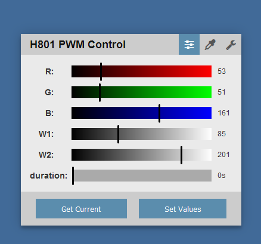
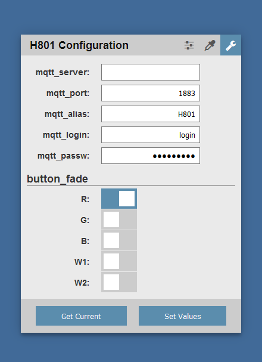

# H801_MQTT
ESP8266 based LED controller using MQTT and/or HTTP

### Features
* Possible to control each channel separatly
* Allows smooth fading from one state to another
* MQTT support
** MQTT Login/Password support
** Possible to set MQTT prefix for topics
* REST API support
* Possible to control using webpage

### Control
Available properties to set

| Property | Info | Range |
|---|---|---|
| `R` | Red channel | 0-255 |
| `G` | Green channel | 0-255 |
| `B` | Blue channel | 0-255 |
| `W1` | White 1 channel | 0-255 |
| `W2` | White 2 channle | 0-255 |
| `duration` | Number of milliseconds used to fade to new state | 0 - 100000000 (1.2 days) |

Each channels fading is handled separatly, this means that it's possible to execute multiple fade event with different duration separatly for each channel.


Example: The following JSON will change the Red channel to max and Green to min over 5 seconds.
```json
{
  "R": 255,
  "G": 0,
  "duration": 5000
}
```

#### MQTT
By sending JSON encoded string to the MQTT topic `{id}/set`, where id is either the unique chip id value or the configured alias, it's possible to control the channels.
The MQTT topic `{id}/updated` will be emitted when changes are made for any of the channels.

#### HTTP POST
By sending JSON encoded string to the `/status` page it's possible to controll the channels.

#### HTTP GET
By doing and HTTP GET on the `/status` page and providing HTML encoded variable, example `/status?R=255&W1=0&duration=5000`, it is possible to set the values.

#### HTTP Page control
The device has an builtin webserver that allows both controlling the PWM channels and updating the MQTT configuration.



### Configuration
#### Updating
MQTT parameters can both be set during WiFi setup and run-time by posting using REST API to `/config`

| Property | Type | Info |
|---|---|---|
| `mqtt_alias` | String | Prefix to use for MQTT topic, if not set Chip ID will be used |
| `mqtt_server` | String | Server address |
| `mqtt_port` | String | Server port, default value 1883 |
| `mqtt_login` | String | Server login |
| `mqtt_passw` | String | Server password, will be hidden over REST |


#### Reset
It's possible to reset the H801 device to initial setup by sending and HTTP DELETE to `/config` twice under 5 seconds. This will reset both the configuration and the WiFi credentials.
